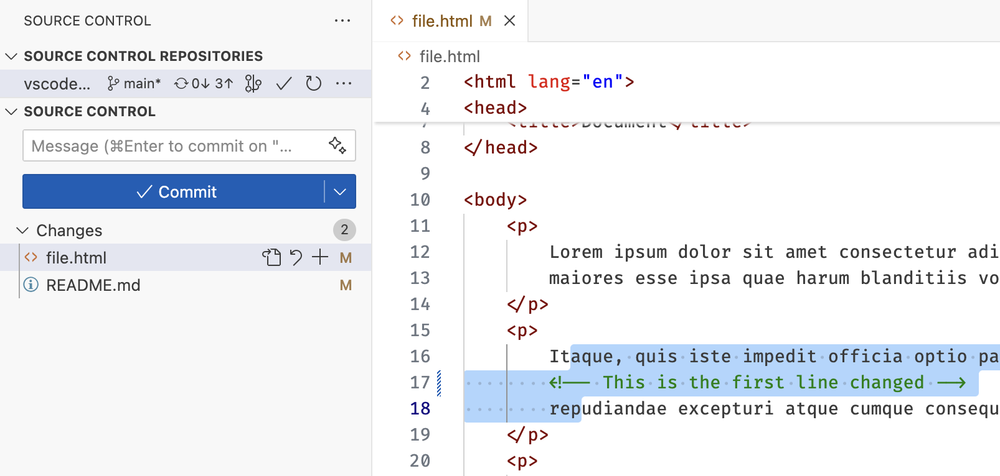
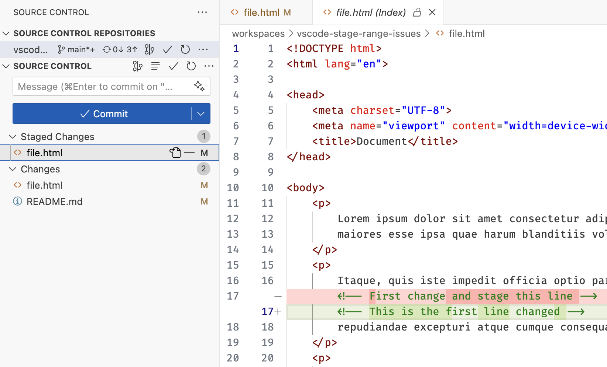
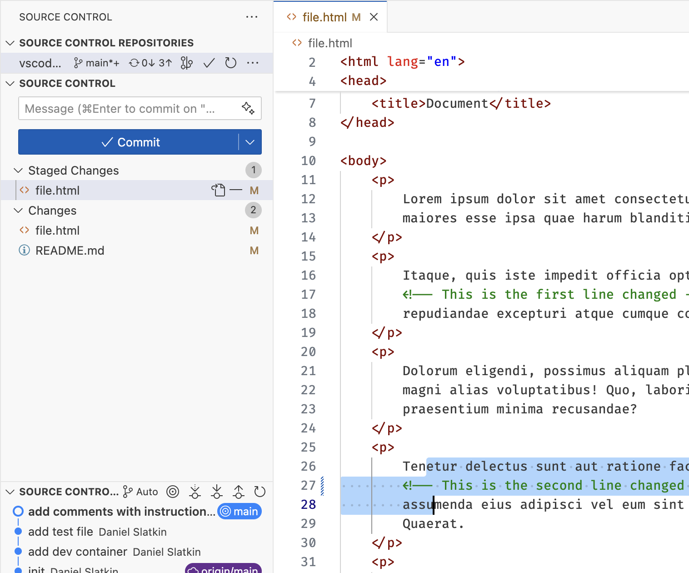
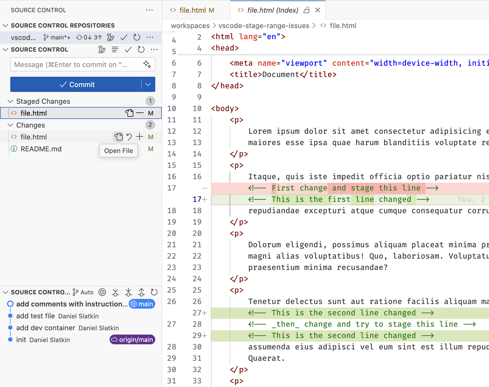
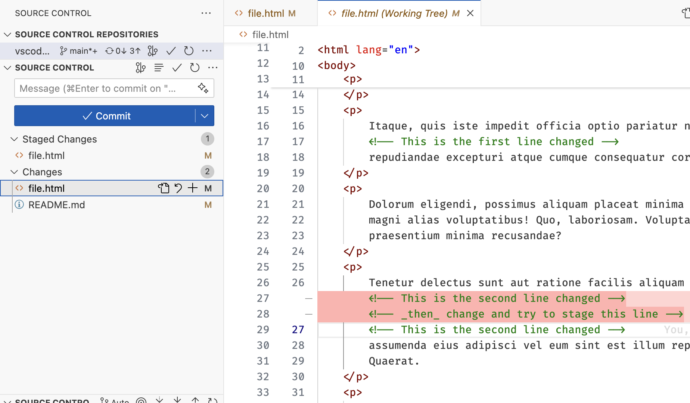

# VS Code "Stage Selected Ranges" Issue Reproduction

This is a repro of some issues described in this [VS Code
issue](https://github.com/microsoft/vscode/issues/235904).

## Steps

1. Clone this repo and open it in VS Code
2. In [file.html](file.html), make a change on line 17
3. Select lines 16-18 which contain that change
4. Choose "Git: Stage Selected Ranges" from the command palette
   - You can see the change is staged without issue
4. Now make a change on line 27
5. Select lines lines 26-28
6. Choose "Git: Stage Selected Ranges" again
   - Now you can see unexpected changes are staged

## Screenshots following these steps

Selection before staging the first change

Diff of the first staged change

Selection before staging the second change

Diff after both changes should have been staged

Diff of remaining unstaged changes

